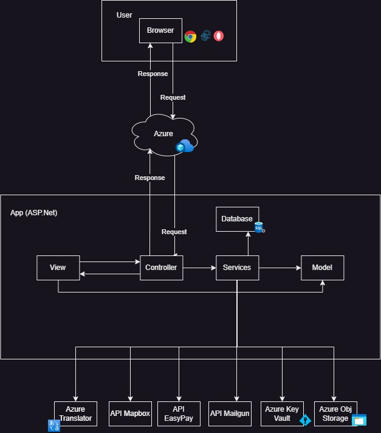
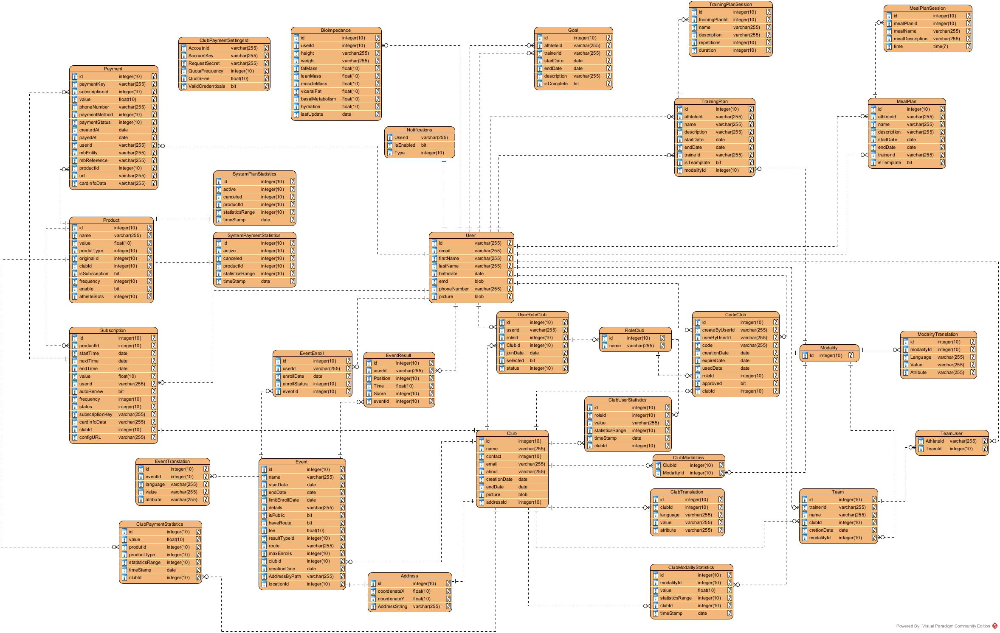

# Projeto de Gestão de Clubes Desportivos

Este repositório contém o código fonte e recursos relacionados ao Projeto de Gestão de Clubes Desportivos, desenvolvido como parte das unidades curriculares ESA (Engenharia de Software Aplicada) e Programação Visual. O projeto tem como objetivo unificar diversas funcionalidades de gestão de clubes desportivos em uma única plataforma acessível via web.

Desenvolvido por:

  
  
  
  
  

## Disclaimer

O repositório inicial deste projeto encontrava-se no bitbucket (em privado) e foi movido para o github, visto que é o mais utilizado. Todas as branches foram mantidas (por opção própria), juntamente com todo o histórico de commits. Por norma era criada uma branch por feature, havendo posteriormente, 4 branches de desenvolvimento (1 por sprint), onde as features eram agregadas e, no final de cada sprint, merged para a master branch.

## Descrição do Projeto

O Projeto de Gestão de Clubes Desportivos visa fornecer uma plataforma abrangente para a administração de clubes desportivos. Este unifica várias funcionalidades essenciais, como gestão de clubes, membros (treinadores, atletas), sócios e eventos. Além disso, oferece um sistema de pagamentos para subscrições de clubes, membros e taxas de eventos.

A aplicação suporta traduções dinâmicas para garantir que os campos sejam compreensíveis para usuários de diferentes idiomas. Também integra recursos de mapeamento da Mapbox para localização de eventos e clubes, facilitando a visualização de suas posições geográficas.

## Metodologia
O projeto foi desenvolvido utilizando a metodologia SCRUM, com base em 4 sprints. A primeira sprint teve duração de aproximadamente 1 mês, enquanto as sprints subsequentes foram planejadas com duração de 2 semanas cada. No final de cada sprint, foram realizadas reuniões de sprint planning, sprint review e sprint retrospective.

## Tecnologias Utilizadas
O projeto foi construído com as seguintes tecnologias e serviços:
- Tecnologias Principais: .NET, Razor Pages
- Base de dados: SQL Server
- APIs Externas Integradas:
  - Easypay: Entidade de pagamento
  - Mapbox: Mapas interativos e localização
  - Mailgun: Serviço de envio de e-mails (confirmações e notificações)
  - Microsoft Translator: Ferramenta de tradução de texto
  - Azure Object Storage: Armazenamento de imagens e documentos
  - Azure Key Vault: Armazenamento de chaves de acesso a APIs externas

# Estrutura do Código 
O código do projeto está organizado da seguinte forma:

- Areas: Código gerado pelo ASP.NET Identity, incluindo views e lógica associada.
- Controllers: Controladores do padrão MVC.
- Data: Classes geradas pelo Entity Framework.
- Middlewares: Middlewares para processamento de pedidos.
- Models: Modelos do MVC. Cada serviço tem sua pasta associada para uma melhor organização.
- Resources: Traduções estáticas em diferentes idiomas.
- Services: Serviços da aplicação, com modelos/classes associados em pastas separadas.
- ViewComponents: Componentes adicionais, como "language picker" e "role selector".
- Views: Views do MVC.

## Integração com Azure Pipelines

Para automatizar o processo de build, testes e deploy do projeto, foi configurada uma integração contínua usando o Azure Pipelines. O fluxo de trabalho foi dividido em duas etapas principais: **Desenvolvimento** e **Produção**.

### Pipeline de Desenvolvimento (Branch de Desenvolvimento)

A cada push na branch de desenvolvimento, o seguinte fluxo de trabalho é acionado:

1. **Build**: O código é compilado e as dependências são instaladas.
2. **Testes Unitários**: Os testes unitários, implementados com xUnit, são executados para verificar a integridade do código.
3. **Testes de Automação**: Os testes de automação, utilizando o Selenium, são executados para verificar a funcionalidade da aplicação.
4. **Deploy de Desenvolvimento**: A aplicação é deployed num ambiente de desenvolvimento para validação adicional por parte dos desenvolvedores.

### Pipeline de Produção (Branch Master)

Quando o código é mesclado na branch master (produção), o seguinte fluxo de trabalho é acionado:

1. **Build**: O código é compilado e as dependências são instaladas.
2. **Testes Unitários**: Os testes unitários são novamente executados para garantir a estabilidade do código.
3. **Testes de Automação**: Os testes de automação são executados mais uma vez para garantir a funcionalidade na versão de produção.
4. **Deploy de Produção**: A aplicação é deployed no ambiente de produção para que os utilizadores finais possam acessá-la.

## Testes Unitários e de Automação

Para garantir a qualidade do código e a funcionalidade da aplicação, foram implementados testes unitários e testes de automação. Em ambos os casos, não foi possível cobrir 100% do código, devido à falta de tempo e outros projetos em paralelo. No entanto, os testes implementados cobrem a maioria das funcionalidades e componentes principais da aplicação.

### Testes Unitários (xUnit)

Foram criados testes unitários utilizando a estrutura xUnit. Esses testes focam em verificar a corretude das funções individuais e componentes do código. São executados automaticamente durante o processo de build e antes do deploy em ambientes de desenvolvimento e produção.

### Testes de Automação (Selenium)

Testes de automação foram criados utilizando o Selenium, uma ferramenta que permite simular interações do usuário com a aplicação. Esses testes verificam o funcionamento correto das funcionalidades em um ambiente mais realista, simulando a interação de um usuário com a interface. Eles também são executados automaticamente durante o processo de build e antes do deploy.

## Design do Projeto
- [Figma Design](https://www.figma.com/file/NsY8SEzp6u5Vo8nOT0bETf/SCManagement?type=design&node-id=27%3A34&mode=design&t=AesbvvTmwRaxYnT5-1)

## Apresentação
O video abaixo, apresenta uma visão geral do projeto, incluindo uma demonstração de suas funcionalidades. Não tem áudio, uma vez que os comentários sobre o conteudo do video, foram realizados em tempo real, durante a apresentação do projeto.
 - [Vídeo de Apresentação](https://www.youtube.com/watch?v=GcSd2VnyqQE)

## Arquitetura Geral

## Diagrama de Classes

## Requisitos do sistema

Na tabela abaixo, são listados os requisitos funcionais, indicados pelo cliente (professor responsável), com uma breve descrição e prioridade. Os requisitos foram divididos em 3 categorias de prioridade: **Must Have** (deve ter), **Should Have** (deveria ter) e **Could Have** (poderia ter). Além disso, alguns requisitos foram marcados como **Won't Have** (não terá), indicando que não serão implementados no projeto.

| ID    | Módulo              | Descrição                                                                                                                                                          | Prioridade    |
|-------|---------------------|-------------------------------------------------------------------------------------------------------------------------------------------------------------------|---------------|
| RF1   | Autenticação        | O sistema deverá permitir ao utilizador realizar o registo na aplicação.                                                                                         | Must Have     |
| RF2   | Autenticação        | O sistema deverá permitir ao utilizador realizar o login na aplicação.                                                                                           | Must Have     |
| RF3   | Autenticação        | O sistema deverá permitir ao utilizador recuperar a palavra passe da sua conta através do e-mail.                                                               | Must Have     |
| RF4   | Autenticação        | O sistema deverá enviar uma confirmação para o e-mail do utilizador quando este se regista.                                                                      | Must Have     |
| RF5   | Autenticação        | O sistema deverá permitir a um utilizador autenticado terminar sessão.                                                                                            | Must Have     |
| RF6   | Autenticação        | O sistema deverá permitir ao utilizador realizar a autenticação na aplicação através de outras plataformas (Google, Microsoft).                                | Could Have    |
| RF7   | Autenticação        | O sistema deverá permitir ao utilizador ativar a sua conta através de um link.                                                                                    | Must Have     |
| RF8   | Autenticação        | O sistema deverá permitir a um utilizador alterar a sua palavra passe.                                                                                            | Must Have     |
| RF9   | Autenticação        | O sistema deverá permitir a um utilizador alterar os seus dados pessoais.                                                                                         | Must Have     |
| RF10  | Autenticação        | O sistema deverá permitir a um utilizador alterar a sua imagem de perfil.                                                                                         | Could Have    |
| RF11  | Autenticação        | O sistema deverá permitir alterar o estado de um utilizador(online/offline).                                                                                       | Won't Have    |
| RF12  | Autenticação        | O sistema deverá permitir gerir as definições de perfil (tema de cores site, notificações).                                                                       | Should Have   |
| RF13  | Autenticação        | O sistema deverá suportar as linguagens português e inglês.                                                                                                      | Must Have     |
| RF14  | Autenticação        | O sistema deverá permitir alterar o idioma da aplicação.                                                                                                          | Must Have     |
| RF15  | Gestão de Clube     | O sistema deverá permitir que os utilizadores gestores de clube visualizem os sócios do clube.                                                                   | Must Have     |
| RF16  | Gestão de Clube     | O sistema deverá permitir que os utilizadores gestores de clube visualizem qual o estado (ativo e inativo) dos sócios.                                           | Should Have   |
| RF17  | Gestão de Clube     | O sistema deverá permitir que os utilizadores gestores de clube retirem os privilégios dos sócios que não pagaram as cotas.                                     | Must Have     |
| RF18  | Gestão de Clube     | O sistema deverá permitir aos utilizadores gestores de clube gerar códigos de acesso para os utilizadores associarem-se ao clube.                                | Must Have     |
| RF19  | Gestão de Clube     | O sistema deverá permitir que os utilizadores utilizem o código de acesso ao clube gerado pelos gestores de clube.                                              | Should Have   |
| RF20  | Gestão de Clube     | O sistema deverá permitir que o utilizador utilize o link enviado (com o código gerado) por e-mail de acesso ao clube.                                           | Should Have   |
| RF21  | Gestão de Clube     | O sistema deverá permitir que seja gerado um QRcode com o código de acesso.                                                                                        | Could Have    |
| RF22  | Gestão de Clube     | O sistema deverá permitir utilizar o QRcode gerado.                                                                                                               | Could Have    |
| RF23  | Gestão de Clube     | O sistema deverá permitir que os gestores de clube visualizem uma lista com os códigos gerados e respetivo utilizador que se juntou com esse código.              | Could Have    |
| RF24  | Gestão de Clube     | O sistema deverá permitir aos utilizadores staff do clube visualizarem os atletas pertencentes ao clube.                                                        | Could Have    |
| RF25  | Gestão de Clube     | O sistema deverá permitir aos utilizadores gestores de clube remover membros do clube.                                                                          | Must Have     |
| RF26  | Gestão de Clube     | O sistema deverá permitir os utilizadores a associarem-se a vários clubes.                                                                                          | Must Have     |
| RF27  | Planos dos Atletas  | O sistema deverá permitir que os utilizadores atletas atualizem o seu EMD.                                                                                        | Could Have    |
| RF28  | Gestão de Clube     | O sistema deverá permitir aos utilizadores staff gerir equipas.                                                                                                   | Must Have     |
| RF29  | Gestão de Clube     | O sistema deverá permitir ao utilizador administrador do clube gerir as modalidades existentes no clube.                                                         | Must Have     |
| RF30  | Gestão de Clube     | O sistema deverá permitir ao utilizador administrador do clube gerir os termos e condições do clube.                                                            | Could Have    |
| RF31  | Gestão de Clube     | O sistema deverá permitir aos utilizadores visualizarem os clubes no mapa.                                                                                        | Could Have    |
| RF32  | Gestão de Clube     | O sistema deverá permitir aos utilizadores visualizarem a página dos clubes.                                                                                      | Should Have   |
| RF33  | Gestão de Clube     | O sistema deverá permitir aos utilizadores procurar clubes.                                                                                                        | Must Have     |
| RF34  | Pagamento           | O sistema deverá permitir a visualização dos planos de subscrição.                                                                                                | Must Have     |
| RF35  | Pagamento           | O sistema deverá permitir aos administradores do clube realizarem o pagamento dos planos de subscrição.                                                         | Must Have     |
| RF36  | Pagamento           | O sistema deverá permitir aos administradores do clube colocar a API Key da plataforma easypay para a realização de pagamento.                                  | Must Have     |
| RF37  | Pagamento           | O sistema deverá permitir aos utilizadores utilizarem diversas formas de pagamento, nomeadamente MBWay, Referencia Multibanco, Cartão de Crédito/Débito.          | Must Have     |
| RF38  | Pagamento           | O sistema deverá permitir aos utilizadores autenticados visualizarem a sua conta corrente.                                                                       | Must Have     |
| RF39  | Pagamento           | O sistema deverá permitir aos utilizadores o pagamento de cotas de sócios dos clubes com a periocidade pretendida.                                               | Must Have     |
| RF40  | Pagamento           | O sistema deverá permitir ao utilizador administrador do clube gerir o plano de subscrição.                                                                      | Must Have     |
| RF41  | Pagamento           | O sistema deverá permitir aos utilizadores gestores de clube atualizar o valor das cotas a pagar pelos sócios.                                                  | Must Have     |
| RF42  | Pagamento           | O sistema deverá permitir aos utilizadores autenticados o pagamento da participação de evento.                                                                  | Should Have   |
| RF43  | BackOffice de controlo | O sistema deverá permitir ao utilizador administrador do sistema gerir os planos de subscrição dos serviços.                                                   | Must Have     |
| RF44  | Pagamento           | O sistema deverá permitir aos utilizadores autenticados selecionar o modo de pagamento a ser utilizado.                                                          | Must Have     |
| RF45  | Eventos             | O sistema deverá permitir aos utilizadores staff do clube gerir os diferentes tipos de eventos e detalhes.                                                       | Must Have     |
| RF46  | Eventos             | O sistema deverá permitir aos utilizadores staff do clube marcar o trajeto do evento no mapa.                                                                     | Must Have     |
| RF47  | Eventos             | O sistema deverá permitir aos utilizadores autenticados gerir a sua inscrição nos eventos.                                                                        | Must Have     |
| RF48  | Eventos             | O sistema deverá permitir que todos os utilizadores consigam visualizar os eventos públicos existentes e detalhes.                                                | Must Have     |
| RF49  | Eventos             | O sistema deverá permitir que todos os utilizadores agregados a um clube consigam visualizar os eventos privados existentes e detalhes.                           | Must Have     |
| RF50  | Eventos             | O sistema deverá permitir que os utilizadores consigam visualizar informações referentes ao mapa do evento (trajeto, elevação, e respetivas informações sobre os mesmos). | Must Have     |
| RF51  | Eventos             | O sistema deverá permitir que os utilizadores possam partilhar os eventos em diferentes plataformas.                                                              | Won't Have    |
| RF52  | Eventos             | O sistema deverá permitir visualizar o número de inscritos num evento.                                                                                              | Could Have    |
| RF53  | Eventos             | O sistema deverá permitir visualizar os resultados de um evento.                                                                                                    | Could Have    |
| RF54  | Eventos             | O sistema deverá permitir visualizar os eventos num calendário.                                                                                                     | Should Have   |
| RF55  | Planos dos atletas  | O sistema deverá permitir que os utilizadores treinadores e administradores de clube possam gerir planos de treino/alimentar e metas para atletas.              | Should Have   |
| RF56  | Planos dos atletas  | O sistema deverá permitir que os utilizadores treinadores e administradores de clube possam gerir templates de planos de treino/alimentar.                     | Could Have    |
| RF57  | Planos dos atletas  | O sistema deverá permitir que os utilizadores atletas possam visualizar planos de treino/alimentar e metas para atletas.                                          | Should Have   |
| RF58  | Planos dos atletas  | O sistema deverá permitir que os utilizadores treinadores possam selecionar a periocidade dos planos treino/alimentar.                                             | Could Have    |
| RF59  | Planos dos atletas  | O sistema deverá permitir que os utilizadores atletas possam gerir os dados referentes à sua bioimpedância.                                                       | Should Have   |
| RF60  | Estatísticas (Clube) | O sistema deverá permitir aos utilizadores gestor do clube visualizar a estatística do número de diferentes utilizadores que existem no clube.                    | Should Have   |
| RF61  | Estatísticas (Clube) | O sistema deverá permitir aos utilizadores gestor do clube filtrar as diferentes estatísticas existentes.                                                         | Could Have    |
| RF62  | Estatísticas (Clube) | O sistema deverá apresentar para o utilizador administrador do clube a estatística da receita que o clube fez (em eventos e quotas) mensal ou anualmente.          | Should Have   |
| RF63  | BackOffice de controlo | O sistema deverá permitir ao utilizador administrador do sistema visualizar a estatística do plano mais e menos aderido.                                         | Must Have     |
| RF64  | BackOffice de controlo | O sistema deverá permitir ao utilizador administrador do sistema visualizar a estatística do número de clubes criados e cancelados.                               | Must Have     |
| RF65  | BackOffice de controlo | O sistema deverá permitir ao utilizador administrador do sistema visualizar a estatística do número de clubes com pagamentos em atraso.                             | Must Have     |
| RF66  | BackOffice de controlo | O sistema deverá permitir ao utilizador administrador do sistema visualizar a estatística do número utilizadores existentes no clube.                               | Must Have     |
| RF67  | BackOffice de controlo | O sistema deverá permitir ao utilizador administrador do sistema visualizar quais os utilizadores online e offline.                                                | Won't Have    |
| RF68  | BackOffice de controlo | O sistema deverá permitir ao utilizador administrador do sistema visualizar o número de códigos utilizados e gerados nos clubes para as inscrições de membros.    | Could Have    |
| RF69  | BackOffice de controlo | O sistema deverá permitir ao utilizador administrador do sistema filtrar as diferentes estatísticas existentes.                                                    | Could Have    |
| RF70  | BackOffice de controlo | O sistema deverá permitir aos utilizadores atualizar os termos e condições dos serviços prestados.                                                              | Won't Have    |
| RF71  | Notificações        | O sistema deverá notificar o utilizador administrador do clube que atingiu a capacidade máxima do seu plano de subscrição.                                         | Must Have     |
| RF72  | Notificações        | O sistema deverá notificar os utilizadores pertencentes ao clube sobre a existência de novos eventos.                                                            | Could Have    |
| RF73  | Notificações        | O sistema deverá notificar os utilizadores inscritos no evento sobre alterações (incluindo cancelamento de eventos) nos eventos.                                  | Could Have    |
| RF74  | Notificações        | O sistema deverá notificar os utilizadores atletas sobre a existência de novos planos/metas.                                                                      | Could Have    |
| RF75  | Notificações        | O sistema deverá notificar os utilizadores atletas sobre alterações nos planos/metas.                                                                             | Could Have    |
| RF76  | Notificações        | O sistema deverá notificar os utilizadores sócios que se esta a aproximar a data de pagamento das suas cotas.                                                     | Should Have   |
| RF77  | Notificações        | O sistema deverá notificar os utilizadores sócios e administrador do clube que tem pagamento de cotas e subscrição em atraso respetivamente.                        | Should Have   |
| RF78  | Notificações        | O sistema deverá notificar o utilizador atleta que atualizou o seu EMD.                                                                                            | Could Have    |
| RF79  | Notificações        | O sistema deverá notificar os utilizadores quando entrar um novo membro do clube.                                                                                 | Won't Have    |
| RF80  | Notificações        | O sistema deverá permitir aos utilizadores indicar quais as notificações que pretendem receber.                                                                   | Should Have   |
| RF81  | Notificações        | O sistema deverá notificar o utilizador administrador do clube que um novo código de utilizador secretaria foi gerado e necessita de validação.                 | Must Have     |
| RF82  | Notificações        | O sistema deverá notificar o utilizador convidado por e-mail que contem um link gerado pela gestão do clube para a adesão ao mesmo.                               | Must Have     |
| RF83  | Gestão do Clube     | O sistema deverá permitir aos utilizadores visualizar os termos e condições do clube.                                                                            | Must Have     |
| RF84  | BackOffice de controlo | O sistema deverá permitir aos utilizadores visualizar os termos e condições do serviço.                                                                          | Must Have     |
| RF85  | Gestão do Clube     | O sistema deverá permitir aos utilizadores visualizar as modalidades do clube.                                                                                     | Must Have     |
| RF86  | Planos dos atletas  | O sistema deverá permitir visualizar os dados de bioimpedância dos atletas.                                                                                       | Should Have   |
| RF87  | BackOffice de controlo | O sistema deverá permitir ao utilizador administrador do sistema visualizar a estatística da receita mensal, anual, e por plano de subscrição.                      | Must Have     |
| RF88  | Estatísticas (Clube) | O sistema deverá permitir aos utilizadores gestor do clube visualizar a estatística do número de sócios ativos e inativos.                                        | Must Have     |
| RF89  | Estatísticas (Clube) | O sistema deverá permitir aos utilizadores gestor do clube visualizar a estatística das modalidades, comparando com o número de integrantes dessas.               | Must Have     |
| RF90  | Estatísticas (Clube) | O sistema deverá permitir aos utilizadores gestor do clube visualizar a estatística do numero dos diferentes tipos de utilizador por ano.                          | Must Have     |
| RF91  | Gestão de Clube     | O sistema deverá permitir aos utilizadores atletas e treinadores visualizarem as equipas a que pertencem.                                                        | Must Have     |
| RF92  | Notificações        | O sistema deverá notificar o utilizador administrador do clube que o utilizador secretaria pretende eliminar um utilizador do tipo secretaria e necessita de validação. | Must Have     |
| RF93  | Gestão de Clube     | O sistema deverá permitir ao utilizador administrador do clube editar informação do clube.                                                                       | Must Have     |
| RF94  | BackOffice de controlo | O sistema deverá permitir ao utilizador administrador de sistema criar e editar modalidades para serem utilizadas pelos clubes.                                   | Must Have     |
| RF95  | BackOffice de controlo | O Sistema deve permitir aos administradores do sistema adicionar e remover outros utilizadores como administradores de sistema.                                | Must Have     |
| RF96  | Planos dos atletas  | O Sistema deve permitir aos atletas visualizarem um cronograma com as suas metas.                                                                                  | Must Have     |
| RF97  | Planos dos atletas  | O Sistema deve permitir aos atletas visualizarem o histórico da sua bioimpedância.                                                                               | Must Have     |
| RF98  | Notificações        | O sistema deverá notificar os utilizadores quando se inscrevem ou saem dos eventos, seja por vontade própria ou por falta de pagamento.                           | Should Have   |
| RF99  | Notificações        | O sistema deverá notificar os atletas quando são adicionados ou removidos de equipas.                                                                            | Should Have   |
| RF100 | Notificações        | O sistema deverá notificar os utilizadores sobre as suas subscrições e pagamentos.                                                                                | Should Have   |
| RF101 | Notificações        | O sistema deverá notificar os utilizadores sobre mudanças de quotas e planos descontinuados.                                                                     | Should Have   |
| RF102 | Notificações        | O sistema deverá notificar o utilizador atleta que está-se a aproximar a data de expiração do seu EMD.                                                           | Won't Have    |
